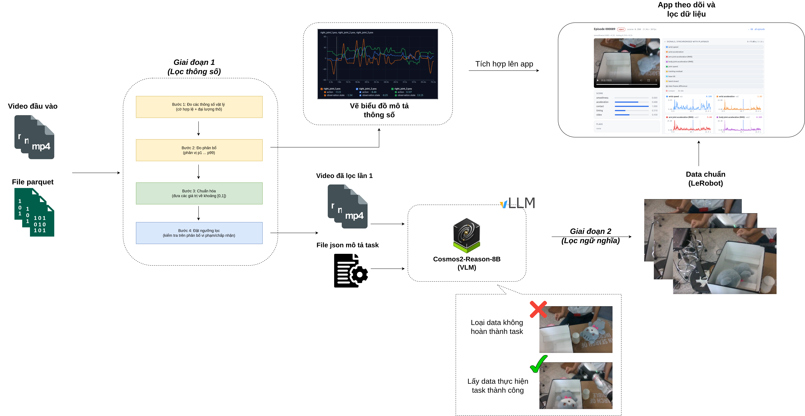

# **LeRobot Episode Scoring Toolkit**

A two-stage pipeline for measuring, scoring and filtering teleoperated LeRobot
episode datasets. Stage 1 filters on **physical parameters** — it measures each
episode in real units (rad/s², m, Hz, s), fits the distribution to your own
data, and rejects episodes that fall outside acceptable limits. Stage 2 filters
on **task semantics** — a Cosmos-Reason vision-language model watches the
surviving recordings and keeps only the episodes where the task actually
succeeded. What comes out is a clean LeRobot dataset, plus a web app for
reviewing every decision next to the video that produced it.

Use this toolkit to:
- **Measure** episodes in physical units first, then score them — measurement and
  scoring are separate, so re-ranking a whole dataset is instant.
- **Filter** on motion quality *and* task success, catching failures no
  kinematic metric can see.
- **Review** each episode with its recording and the signals it was judged on,
  side by side.
- **Export** measurements, scores and the accepted-episode list.

## The pipeline



| stage | what happens |
|---|---|
| **Input** | LeRobot `.parquet` trajectories + `.mp4` recordings |
| **Stage 1 — parameter filter** | ① measure physical quantities (validity flags + raw units) → ② fit distributions (p1…p99) → ③ normalize to `[0,1]` → ④ apply limits/thresholds. Also renders the per-episode signal charts. |
| **Stage 2 — semantic filter** | the stage-1 survivors, plus a JSON task description, go to **Cosmos-Reason** (served over vLLM). Episodes that did not complete the task are discarded; successful ones are kept. |
| **Output** | a clean LeRobot dataset, and everything integrated into the web app for monitoring and review. |

## Table of Contents
- [Installation](#installation)
- [Quick Start](#quick-start)
- [Stage 1 — parameter filter](#stage-1--parameter-filter)
- [Stage 2 — semantic filter](#stage-2--semantic-filter)
- [The web app](#the-web-app)
- [Outputs](#outputs)
- [Documentation](#documentation)
- [Repository Structure](#repository-structure)
- [License](#license)

---

## ⚙️ Installation

### Prerequisites
- Python 3.10 or higher
- pip (or [uv](https://github.com/astral-sh/uv) for faster installs)

The metrics layer needs only `numpy`, `pandas`, `opencv-python` and `pyarrow`.
Everything else is an optional extra, so a measurement-only run stays light.

```bash
git clone https://github.com/RoboticsData/score_lerobot_episodes.git
cd score_lerobot_episodes

# metrics only (Stage 1 measurement + scoring, batch CLI)
pip install -e .

# + the web app
pip install -e ".[app]"

# + the semantic filter (Stage 2, talks to a vLLM server)
pip install -e ".[app,semantic]"
```

`uv pip install -e ".[app,semantic]"` works the same and is faster.

---

## 🚀 Quick Start

Point the pipeline at a local dataset folder — the directory that holds `meta/`,
`data/` and `videos/`.

```bash
# Interactive: measure once, then review each episode beside its signals
pip install -e ".[app]"
python -m app                                 # http://127.0.0.1:8000

# Batch: measurements, scores and standalone HTML pages for the 15 worst episodes
python scripts/measure_dataset.py pickup_20260628_150622 --html 15
```

That is Stage 1. To add Stage 2, start a Cosmos-Reason vLLM server (see
[Stage 2](#stage-2--semantic-filter)) and pass `--semantic`, or run the semantic
filter from the app.

---

## 📏 Stage 1 — parameter filter

Stage 1 measures each episode in physical units, fits the acceptable range to
your own dataset, and turns raw quantities into a `0–1` score and an
accept/review/reject decision. Measurement is separate from scoring on purpose:
measuring 90 episodes with video takes minutes, re-scoring them takes
milliseconds — which is what lets the app re-rank the whole dataset as you drag a
slider.

### Metric families

Each family targets a specific failure mode across three time scales that no
single statistic spans (see [`docs/architecture.md`](docs/architecture.md)):

| family | measures | key quantity |
|---|---|---|
| smoothness | trajectory *shape* | LDLJ on wrist, arm and body chains |
| acceleration | trajectory *magnitude* | RMS and p99 per chain |
| contact | inferred collisions | events/second, 2-of-3 quorum |
| timing | duration, dead time, regrasps | seconds, fraction, transition count |
| video | recording quality and integrity | Laplacian variance, decode ratio |

### Flags come before distributions

Four preconditions are checked before any percentile is computed, and flagged
episodes are excluded from the calibration sample — a motionless reset recording
can otherwise score the *best* smoothness in the set and skew every threshold:

| flag | condition |
|---|---|
| `degenerate` | wrist path < 0.30 m (motionless) |
| `grasp_incomplete` | < 2 hand transitions (the grasp cycle never happened) |
| `video_unreadable` / `video_truncated` | decode fails, or < 95 % of declared frames present |
| `self_collision_suspect` / `video_frozen` | flagged for review, not auto-rejected |

### Batch CLI

```bash
# measurements and scores only, no video decoding (fastest)
python scripts/measure_dataset.py pickup_20260628_150622 --no-video

# full run with the synchronised HTML visualisation for the 15 worst episodes
python scripts/measure_dataset.py pickup_20260628_150622 --html 15
```

Useful flags (`--help` for the full list):

| flag | purpose |
|---|---|
| `--out-dir DIR` | where to write outputs (default `quality_report`) |
| `--camera KEY` | camera to score (default: first `observation.images.*`) |
| `--no-video` | skip the video family (much faster first pass) |
| `--workers N` | parallel episodes |
| `--lo-pct` / `--hi-pct` | percentiles bounding each fitted range (default 5 / 95) |
| `--mode` | decision rule: `absolute` (the default — one threshold, physical anchors), `gate`, `rules` (per-unit limits) or `weighted` |
| `--profile FILE` | absolute mode: load anchors and do not refit — what makes one threshold transfer between datasets |
| `--fit-profile OUT` | fit the anchors on this dataset and write them out. Run once, on a batch you trust |
| `--threshold` | accept threshold (0.5 for `absolute`, 0.35 for `gate` / `weighted`) |
| `--api-key` | credential for a hosted semantic endpoint (`COSMOS_API_KEY`). Leave it off for a local vLLM server |
| `--drift` | report how far this dataset sits outside the loaded anchors |
| `--html [N]` | render the synchronised visualisation for the N worst episodes |

An equivalent console entry point is installed as `measure-dataset`.

---

## 🧠 Stage 2 — semantic filter

The five families answer *how* the robot moved. None can answer *whether the
task was done* — an episode can be smooth, gentle, prompt and well filmed while
the object ends up beside the box instead of in it. On the reference dataset the
kinematic score of the hand-discarded episodes (0.656) is indistinguishable from
the kept set (0.644); the difference is task failure, which is exactly the gap
Stage 2 fills.

A **Cosmos-Reason** vision-language model, served over a local vLLM
OpenAI-compatible endpoint, watches each surviving recording and issues one
verdict per episode:

- `1.0` — goal reached
- `0.5` — attempted (object grasped and moved toward the target)
- `0.0` — not reached

The verdict enters the decision as a **hard gate** (reject at `0.0`, review at
`0.5`), never as a weighted term — a half-done task is not compensated by a
smooth trajectory. Verdicts are cached to JSONL keyed by `(video, task)`, so a
re-run costs nothing and an interrupted run resumes.

### Serve the model

```bash
uv run vllm serve nvidia/Cosmos-Reason2-2B \
  --allowed-local-media-path "$(pwd)" \
  --max-model-len 32768 \
  --media-io-kwargs '{"video": {"num_frames": 16}}' \
  --port 8000
```

(`src/score_lerobot_episodes/script_host_vllm.sh` holds this command.)

### Run the filter

```bash
python scripts/measure_dataset.py pickup_20260628_150622 \
  --semantic \
  --semantic-base-url http://127.0.0.1:8000/v1 \
  --semantic-model nvidia/Cosmos-Reason2-2B \
  --task "put the teddy bear in the box"
```

A hosted endpoint instead of a local server takes `--api-key` (or
`COSMOS_API_KEY`). Leave it off for local vLLM: blank means no credential is
sent at all, which is what that server expects.

Or run it from the web app once the server is reachable
(`POST /api/datasets/{id}/semantic`). `COSMOS_BASE_URL` and `COSMOS_MODEL`
supply the endpoint and model name if you prefer environment variables.

---

## 🖥️ The web app

A FastAPI backend and a single-page frontend for measuring a dataset once and
reviewing it interactively — the recording plays beside the exact signals it was
judged on, with a shared playhead and contact/idle shading. There is no build
step and no npm; the frontend is three files under `app/static/`.

```bash
pip install -e ".[app]"
python -m app                                    # http://127.0.0.1:8000
python -m app --port 9000 --reload
python -m app --dataset ./pickup_20260628_150622 # register at startup
```

Workflow: add a dataset → run measurement (a cached background job) → review the
overview → open an episode → tune the decision rule (re-scoring is in-process and
takes milliseconds) → run the semantic filter → export. Interactive API docs are
at `/docs`. See [`docs/app.md`](docs/app.md) for the full API and view reference.

---

## 📂 Outputs

- **`quality_report/`** (batch CLI) — `measurements.csv` in physical units,
  scores, and optional standalone HTML visualisation pages.
- **`.quality_app/`** (web app) — cached measurements, calibration and semantic
  verdicts, so a restart never re-measures. Deleting it costs one re-measure.
- **Exports** — measurements joined with scores as CSV
  (`GET /api/datasets/{id}/export.csv`), or the accepted-episode list as JSON
  (`export.json?decision=accept`).

The `measurements.csv` carries raw physical units, so a domain expert can
disagree with a threshold without re-deriving the metric.

---

## 📚 Documentation

| document | what it covers |
|---|---|
| [`docs/architecture.md`](docs/architecture.md) | how the measure → normalize → decide layers fit together, and why they are split |
| [`docs/absolute_scoring.md`](docs/absolute_scoring.md) | one threshold across every dataset: physical anchors, noisy-OR, drift |
| [`docs/app.md`](docs/app.md) | the web app: API, views, workflow, caching |

---

## 📁 Repository Structure

```
score_lerobot_episodes/
├── src/score_lerobot_episodes/
│   ├── metrics/              # the Stage 1/2 pipeline
│   │   ├── signals.py        # load parquet, mask dead channels, differentiate
│   │   ├── measure.py        # raw physical quantities + flags (no thresholds)
│   │   ├── normalize.py      # ranges fitted to your data → accept/review/reject
│   │   ├── profile.py        # absolute anchors in physical units → one threshold
│   │   ├── semantic.py       # Stage 2: Cosmos-Reason task-success gate
│   │   ├── visualize.py      # standalone HTML page, burned-in overlay mp4
│   │   ├── cli.py            # batch entry point (measure-dataset)
│   │   └── assets/           # chart.js / theme.css shared by app + HTML export
│   ├── vlm.py                # Cosmos-Reason vLLM client
│   └── scores/               # legacy single-tier scoring facade
├── app/                      # FastAPI backend + vanilla-JS SPA (python -m app)
│   ├── main.py               # routes, video streaming, static mounts
│   ├── service.py            # registry, jobs, caching, scoring
│   └── static/               # index.html, app.css, app.js
├── scripts/
│   ├── measure_dataset.py    # batch pipeline runner
│   └── ...
├── docs/                     # architecture.md, app.md, pipeline.png
├── pyproject.toml            # package + optional extras (app, semantic, legacy)
├── LICENSE
└── README.md
```

> The pre-2.0 HuggingFace/Gemini scoring path (`score_dataset.py`, `train.py`,
> the Streamlit `ui.py`) is superseded by the pipeline above and kept only under
> the `legacy` extra (`pip install -e ".[legacy]"`).

---

## 📄 License

LeRobot Episode Scoring Toolkit is distributed under the **Apache 2.0 License**.
See [LICENSE](LICENSE) for more information.

## 📧 Support

- **Issues**: [GitHub Issues](https://github.com/RoboticsData/score_lerobot_episodes/issues)
- **Discussions**: [GitHub Discussions](https://github.com/RoboticsData/score_lerobot_episodes/discussions)
